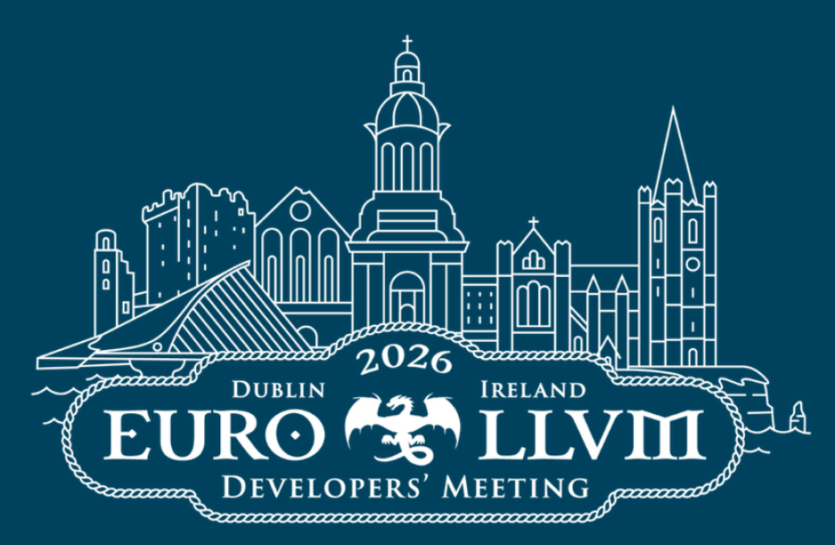

# Reflections from EuroLLVM 2026: Hardware Safety and the Future of MLIR

I’ve just wrapped up a few intense days at the [2026 European LLVM Developers’ Meeting](https://llvm.org/devmtg/2026-04/) in Dublin. As always, it brought together a dense mix of compiler engineers and systems researchers pushing on the boundaries of [Clang](https://clang.llvm.org/), [LLVM](https://llvm.org/), and [MLIR (Multi-Level Intermediate Representation)](https://mlir.llvm.org/).

Two themes stood out in particular: **Project Lighthouse** and **CHERI**. They point in different directions, but together they say a lot about where the ecosystem is heading.

---

## 1. Project Lighthouse: Making MLIR Less Fragmented

If MLIR is the *Swiss Army knife* of modern compilers, Project Lighthouse is an attempt to make the pieces actually work together in practice.

Today, MLIR has a rich set of dialects and transformations—but many real systems still live downstream in isolated projects. The result is fragmentation: components exist, but end-to-end pipelines are often rebuilt rather than reused.

Lighthouse is trying to address this by acting as a **cohesion layer for end-to-end MLIR systems**, rather than a collection of disconnected examples.

* **End-to-end focus**: Instead of isolated snippets or experimental passes, it emphasizes complete pipelines that connect dialects, transforms, and execution paths in a consistent way.
* **Cross-project integration**: It provides a place where systems like EmitC or ClangIR can validate how their components compose before diverging downstream.
* **Validation infrastructure**: It also serves as a testbed for checking assumptions in MLIR—how passes interact, how dialects compose, and where integration breaks down.

A good example of the direction the ecosystem is moving in came from a EuroLLVM session titled [*“MLIR iteration cycle goes brrr: defining ops and rewrites in Python”*](https://llvm.swoogo.com/2026eurollvm/session/3943076/mlir-iteration-cycle-goes-brrr-defining-ops-and-rewrites-in-python
). It showcased the MLIR Python bindings, where dialect operations, passes, and rewrite patterns can be defined directly in Python for rapid experimentation.

This doesn’t redefine Lighthouse itself, but it reflects the broader direction: making MLIR development more interactive and iteration-driven, while still anchored in the C++ core.

---

## 2. CHERI: Tightening the Hardware–Software Contract

Memory safety remains one of the hardest problems in systems programming. [Rust](https://www.rust-lang.org/) provides a strong foundation for new systems, but the reality is that most critical infrastructure is still built on large C and C++ codebases that can’t realistically be rewritten.

[CHERI (Capability Hardware Enhanced RISC Instructions)](https://www.cl.cam.ac.uk/research/security/ctsrd/cheri/) explores a different direction: instead of changing the language, it modifies the hardware–software contract to support memory-safe and compartmentalised execution.

The key idea is to replace conventional pointers with **capabilities**—architectural values that carry:

* an address,
* explicit bounds and permissions,
* and a hardware-enforced validity tag.

The processor enforces how capabilities are created, narrowed, and dereferenced, preventing them from being forged or used outside their allowed range.

### What this enables in practice

* **Fine-grained spatial safety**: Bounds are enforced per pointer rather than at page level.
* **Stronger isolation within processes**: CHERI enables compartmentalisation so that components in the same address space can be isolated from each other.
* **Hybrid deployment model**: Capability-aware code can coexist with conventional C/C++ code, allowing incremental adoption rather than requiring a full rewrite.

### Important constraints

* **Not full memory safety**
  CHERI primarily guarantees *spatial safety*. Temporal issues (like use-after-free) are not fully solved by the hardware model alone and still require additional techniques.

* **System-wide changes required**
  CHERI is not just an ISA extension—it affects compilers (notably Clang/LLVM), operating systems, and runtime assumptions about pointers.

* **Early ecosystem maturity**
  Most deployments today are on research or prototype platforms such as ARM Morello and CHERI-RISC-V. The software stack is real, but still evolving.

* **Performance trade-offs are still being studied**
  Capability metadata and wider pointer representations introduce costs that are not yet fully characterised across all workloads.

### Where it fits

CHERI is not a replacement for safe languages, nor a general solution to memory safety. It is better understood as a **pragmatic hardware-assisted model for reducing memory corruption in large existing systems**, particularly where rewriting is not feasible.

That makes it less of a clean break and more of a long-term infrastructure bet: incremental, constrained, but potentially impactful where it matters most.

---

## Final Thoughts

What stood out most this year is how the space is pulling in two directions at once.

On one side, MLIR—and efforts like Lighthouse—are pushing toward more composable, integrated compiler systems. On the other, CHERI is trying to move safety guarantees down into hardware for systems that can’t realistically be rewritten.

One is about making it easier to build new systems. The other is about making existing ones safer.

Both feel increasingly relevant.

