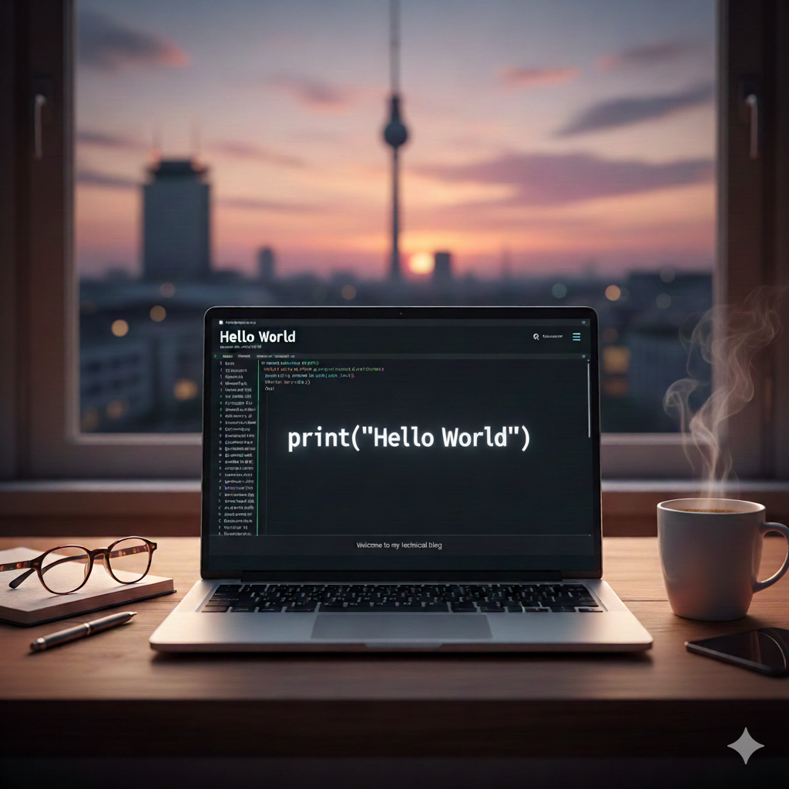

Welcome to my blog.

I’m Bruno Caballero, a Lead Software Engineer based in Berlin. This space is where I’ll be sharing thoughts, notes, and deep dives into the technologies I work with and care about.

My background is rooted in low-level and runtime-focused software engineering, with a strong interest in understanding how systems behave under the hood—from execution models to performance characteristics and tooling.

The goal of this blog is simple:
- explore technology in depth  
- document learnings and experiments  
- share practical insights from real-world systems  

More technical articles coming soon!
