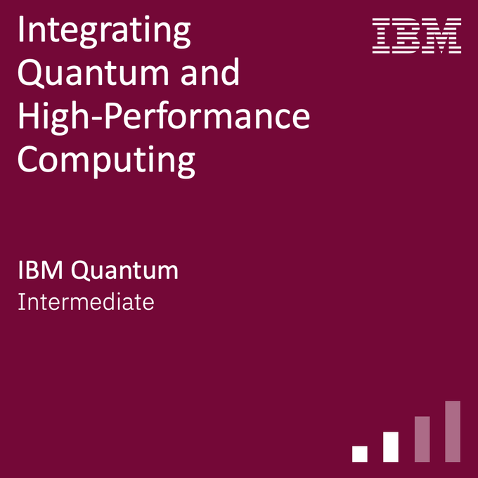

I recently earned a new IBM badge: **[Integrating Quantum and High-Performance Computing](https://www.credly.com/badges/98f71354-c2a3-42ac-a1b4-0f3958d73881/public_url)**!

The badge focuses on the algorithmic motivations for combining quantum and classical HPC resources. It covers how to characterize and benchmark each, where they overlap, where they differ, and how programming models can integrate quantum resources into hybrid workflows.

The practical component involved implementing such a workflow in a simulated HPC environment. 

If you're interested in quantum–classical hybrid computing, the badge material provides a solid entry point into the topic.