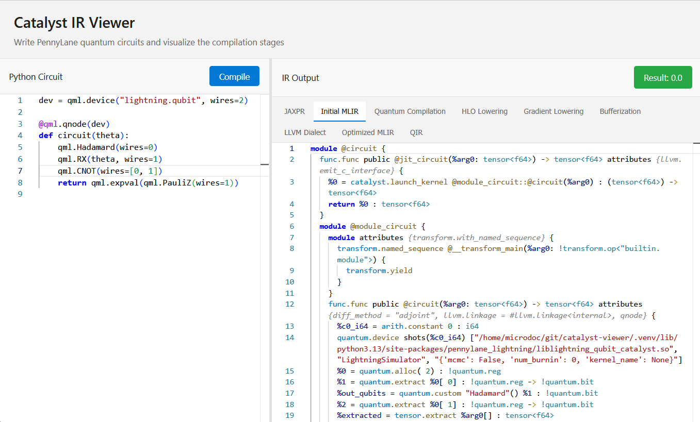

  

### New Project: PennyLane Catalyst Compiler Viewer 🚀

I started a new project: [PennyLane Catalyst Compiler IR Viewer](https://github.com/bruno-ah-um/pennylane-catalyst-compiler-viewer). I’m experimenting with intermediate representations (IR) in quantum compilers. This new tool lets you inspect and visualize IR in PennyLane Catalyst, helping understand how high-level quantum programs are lowered to hardware operations, debug transformations, and prototype ideas in quantum compiler design.

It’s an experimental playground for quantum IR research for testing and exploration.