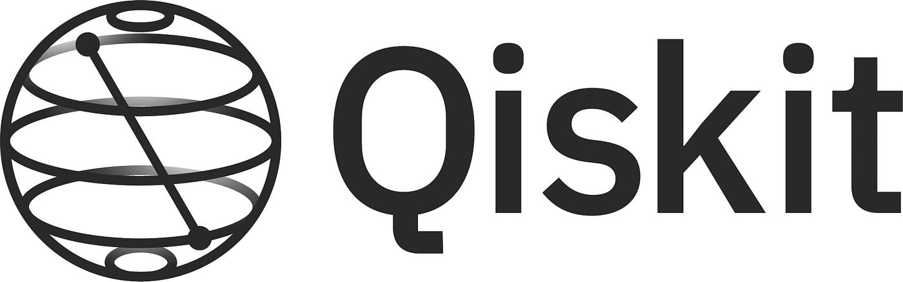
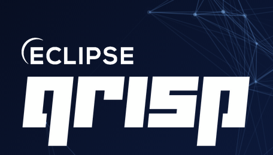

Open source is how quantum computing moves forward. The tools we use — compilers, runtimes, simulators — are built in the open, and I think it matters to be part of that, not just a user of it. After using these projects, I decided it was time to contribute back. So I set out to make my first contributions to two projects I care about: **Qiskit** and **Qrisp**.

## Qiskit: DAG-Based Transpiler Passes in the C API

My [Qiskit contribution](https://github.com/Qiskit/qiskit/pull/15614) adds DAG-based variants of seven transpiler passes to the C API, shipped in Qiskit 2.4.0.

The existing C API only exposed circuit-level interfaces, so chaining passes required repeated circuit↔DAG conversions that add up quickly in real transpilation pipelines. In this PR, I added functions like `qk_transpiler_pass_elide_permutations()`, `qk_transpiler_pass_optimize_1q_gates_decomposition()`, and five more that operate directly on `QkDag` objects, while the circuit-level variants now reference the DAG ones. This lets C API users compose multi-pass workflows without repeated conversions and reduces overhead in transpilation-heavy pipelines.

What I find compelling about Qiskit's architecture is the combination of Rust internals for performance with a Python interface for usability — and on top of that, a C API that makes it straightforward to call into Qiskit from any language. That's a well-thought-out stack.

## Qrisp: xDSL Dialect Registration for JASP Quantum

My [Qrisp contribution](https://github.com/eclipse-qrisp/Qrisp/pull/465) registers the JASP quantum dialect with xDSL.

Types and operations in the JASP dialect were unregistered, so they appeared as raw strings like `!"jasp.QuantumState"` in the IR and broke typed pattern matching in xDSL passes. I fixed this by formally defining the dialect with three types (`QuantumState`, `Qubit`, `QubitArray`) and twelve operations (`create_qubits`, `get_qubit`, `measure`, `quantum_gate`, and others), all implemented as proper `IRDLOperation` subclasses and loaded into the xDSL context. With that in place, xDSL passes can now match and transform JASP operations and types natively instead of relying on string-based handling.

Qrisp is an [Eclipse Foundation](https://www.eclipse.org/) project, which means it doesn't depend on any single company to survive. It's earlier in its development than Qiskit, but it has a motivated community behind it. That combination of governance and community energy makes it a project worth watching and contributing to.

I am planning to continue developing JASP in Qrisp, and I wanted to align with other people in the project first so we can define the direction of the work together.

## Why This Matters to Me

Neither of these was a heroic change. They're focused, concrete improvements to real infrastructure. I learned that small compiler infrastructure contributions can unlock much bigger downstream improvements for users and contributors. That's exactly the kind of contribution that keeps open source projects healthy, and I want to keep doing more of it.
