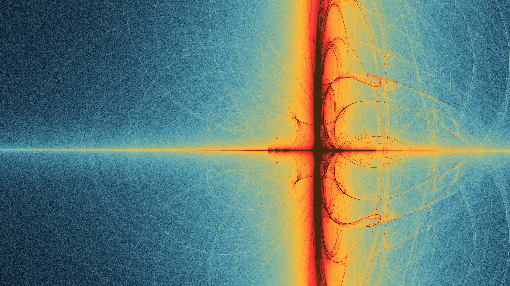

*Photo by [Marek Pavlík](https://unsplash.com/de/@marpicek) on [Unsplash](https://unsplash.com/de/fotos/abstraktes-fraktales-muster-mit-warmen-und-kuhlen-farben-d5w6mtk9Wf8)*

I have been curious about quantum error correction for a while. Every time I read about fault-tolerant quantum computing, QEC appears as the central engineering challenge: the layer that connects noisy devices to reliable computation. So I decided to stop skimming papers and start learning this topic properly.

This post marks the beginning of that journey.

I recently worked through the [Quantum Error Correction course on Coursera](https://www.coursera.org/learn/quantum-error-correction), and I am reading papers alongside it, including work on FPGA implementations of real-time decoders. I am still early in the process, but I wanted to document what clicked so far and what I still need to understand better.

The FPGA angle pulled me in especially strongly. During my studies I spent a lot of time working with FPGAs: DSP pipelines, crypto accelerators, and using FPGA-accelerated FFT for my master thesis. Reading about real-time QEC decoding on FPGA fabric felt like two worlds I care about colliding in the best way.

<!--more-->

---

## The question that got me hooked

I work on compilers. My day-to-day is thinking about how high-level programs get translated, step by step, into something a machine can actually execute. So when I started reading about quantum error correction, the question that immediately grabbed me was not "how does a surface code work in theory" — it was:

**What happens to a Qiskit or Qrisp program on the way to real hardware?**

When you write something like this:

```python
from qiskit import QuantumCircuit
qc = QuantumCircuit(2)
qc.h(0)
qc.cx(0, 1)
qc.measure_all()
```

...you are describing a circuit in terms of *logical* operations on *logical* qubits. But actual quantum hardware does not have perfect logical qubits. It has noisy physical qubits that decohere in microseconds. The gap between those two worlds is enormous, and the thing that bridges them is the error correction stack.

The full translation chain, from a high-level quantum program down to physical pulses with continuous decoding and feedback, is what I want to understand. I am nowhere near the full picture yet, but I finally feel that I have a map to follow.

## What I have learned so far

At a high level, QEC is not one algorithm you run once. It is an always-on control loop:

1. Encode one logical qubit across many physical qubits.
2. Repeatedly measure stabilizers to detect error syndromes.
3. Decode syndromes fast enough to keep up with hardware cycles.
4. Apply corrections (or track them in software) without destroying the computation.

What surprised me most is how much of this challenge is systems engineering: timing constraints, decoder latency, classical-quantum interfaces, and architecture tradeoffs. The math is essential, but so is the implementation discipline.

One promising current direction is the **Union-Find (UF) decoder** for surface codes. In short, it groups defect measurements into clusters, grows and merges odd clusters until they become consistent, and then builds corrections. In the paper [FPGA-based Distributed Union-Find Decoder for Surface Codes](https://arxiv.org/abs/2406.08491), the authors show an FPGA implementation (Helios) with very low latency and strong scalability: for example, they report 11.5 ns average decoding time per round at distance 21 (0.1% phenomenological noise), and up to distance 51 with a resource-optimized configuration. It is an exciting example of how decoder algorithms and hardware architecture can be co-designed.

## Why this matters for me

I care about compilers and runtime stacks. QEC sits right at the boundary between abstract programs and physical reality, and that is exactly where I like to work.

For now, my goal is simple: build a practical understanding of the full stack from logical circuits to fault-tolerant execution. That means learning the theory, reading implementations, and experimenting with tooling over time.
